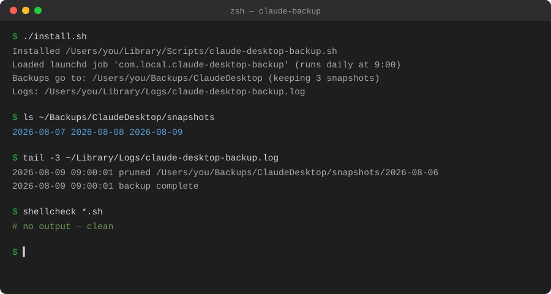

# claude-backup

[](https://github.com/jchan023/claude-backup/releases/tag/v1.5.1)
[](https://github.com/jchan023/claude-backup/actions/workflows/ci.yml)
[](LICENSE)
[](LICENSE)

Daily backup of both **Claude Desktop's** app state and the **Claude
Code CLI's** state (macOS) to your backup location of choice, using
`launchd`.



It backs up two sources, into `latest/desktop/` and `latest/cli/`
respectively:

**Claude Desktop** (`~/Library/Application Support/Claude`):

- `claude_desktop_config.json`, `config.json`, `buddy-tokens.json` — app
  config and auth/session tokens (lets you skip re-logging-in after a
  restore; optional, see [Security](#security))
- `window-state.json`, `git-worktrees.json`, `plan-usage-history.json`,
  `cowork-enabled-cli-ops.json` — settings
- `claude-code-sessions/`, `local-agent-mode-sessions/` — conversation and
  session history

It deliberately **excludes** `Cache/`, `Code Cache/`, `GPUCache/`,
`IndexedDB/`, `Local Storage/`, and similar browser-cache directories from
this source — they regenerate automatically and just waste space (Claude
Desktop's data directory is a Chromium/Electron profile, so most of its
multi-GB footprint is disposable cache).

`local-agent-mode-sessions/skills-plugin/` (Anthropic's built-in skill
implementations, e.g. `xlsx`/`pdf`/`docx`) **is** backed up, even though
it's app-managed content that the app likely re-syncs on its own —
everything points that way (`.claude-plugin/plugin.json` identifies it as
"Anthropic-managed skills for Claude Desktop", and `config.json` tracks a
`remote_marketplace_migration_done_v1` flag), but that's inference, not a
verified guarantee, and there was no safe way to test it against a real
install without risking the live app. At ~4MB it's cheap enough to just
include rather than gamble on it.

**Claude Code CLI** (`~/.claude`) — mirrored wholesale, no allowlist,
since it's small (tens of MB, not GBs):

- `settings.json` — CLI settings
- `mcp.json` — your MCP server definitions (can contain API keys;
  optional, see [Security](#security))
- `plugins/installed_plugins.json`, `plugins/known_marketplaces.json` —
  installed plugins and marketplaces
- `projects/` — Claude Code session transcripts **and your memory system**
  (`projects/**/memory/MEMORY.md` and every individual memory file)

Keeps a `latest/` mirror plus a small number of dated snapshots so you can
recover from an accidental overwrite, not just the most recent state — see
[Snapshot pruning](#snapshot-pruning) for how that works.

Several of the files above hold auth/session credentials — see
[Security](#security) before you install, especially if you're deciding
whether to back them up at all.

## Contents

- [Install](#install)
- [Choosing a backup location](#choosing-a-backup-location)
- [Security](#security)
- [Snapshot pruning](#snapshot-pruning)
- [Usage examples](#usage-examples)
- [Restore](#restore)
- [Uninstall](#uninstall)
- [Logs](#logs)
- [Failure alerts](#failure-alerts)
- [Troubleshooting](#troubleshooting)
- [Changelog](CHANGELOG.md)

## Install

```bash
git clone https://github.com/jchan023/claude-backup.git
cd claude-backup
./install.sh
```

By default this backs up to `~/Backups/ClaudeDesktop` and runs daily at
9:00 AM. Override with environment variables before running `install.sh`:

```bash
CLAUDE_BACKUP_DEST="$HOME/Backups/ClaudeDesktop" \
CLAUDE_BACKUP_KEEP=3 \
CLAUDE_BACKUP_HOUR=9 \
CLAUDE_BACKUP_MINUTE=0 \
./install.sh
```

- `CLAUDE_BACKUP_DEST` — your backup location, where backups are written
  (must be set at run time too, e.g. in your shell profile, since it's
  read by the backup script itself, not just the installer)
- `CLAUDE_BACKUP_KEEP` — number of dated snapshots to retain
- `CLAUDE_BACKUP_HOUR` / `CLAUDE_BACKUP_MINUTE` — daily run time (24h)
- `CLAUDE_BACKUP_INCLUDE_CREDENTIALS` — set to `0` to skip
  credential-bearing files entirely; see [Security](#security)

## Choosing a backup location

`CLAUDE_BACKUP_DEST` can point anywhere: a plain local folder, an external
drive, or — for offsite/cloud backup — the local folder that your cloud
sync app (Google Drive, OneDrive, iCloud Drive, or similar) keeps synced.
No code changes needed either way:

```bash
CLAUDE_BACKUP_DEST="$HOME/Library/CloudStorage/GoogleDrive-you@gmail.com/My Drive/Backups/ClaudeDesktop" \
./install.sh
```

Two things to know if your backup location is a cloud-synced folder:

- **This backs up to a local path that some other process syncs to the
  cloud**, not directly to a cloud API. If you use Google Drive in
  "Stream" mode, its mount point is usually under
  `~/Library/CloudStorage/GoogleDrive-<account>/My Drive`.
- **Hardlinked snapshots need a real filesystem.** Some cloud-sync mounts
  (notably Google Drive Stream, and some network mounts) don't support
  hardlinks. The script already handles this — `cp -al` (hardlink) is
  tried first and falls back to a full `cp -a` copy automatically — but on
  those destinations each snapshot uses real extra disk space instead of
  being nearly free.

`CLAUDE_BACKUP_DEST` must be set when you run `install.sh`, not just
exported in your shell — launchd doesn't inherit your terminal's
environment, so `install.sh` bakes it into the launchd job's
`EnvironmentVariables` at install time. To change the backup location
later, just re-run `install.sh` with the new value.

## Security

**This backup is only as secure as wherever you point `CLAUDE_BACKUP_DEST`.**
It doesn't encrypt anything — it copies files. If your cloud account
(Google Drive, OneDrive, etc.) is ever compromised, shared, or synced onto
a device you don't fully trust, everything in the backup is exposed too,
including the credential files below. Use a private, personal account
with strong auth (2FA) on whatever you point this at, and treat the
backup location itself as security-sensitive, not just the original
files.

**Cloud version history can outlive your local cleanup.** If a token
ever leaks and you rotate it, deleting the old backup file locally
doesn't necessarily purge it — Google Drive/OneDrive/etc. often keep prior
versions of a file for weeks or months after it's overwritten or deleted,
depending on their retention settings and your plan.

**What's actually credential-bearing:**

| File | Source | Contains |
|---|---|---|
| `buddy-tokens.json` | Desktop | auth/session tokens |
| `config.json` | Desktop | OAuth token caches |
| `claude_desktop_config.json` | Desktop | can include API keys in MCP server `env` blocks |
| `mcp.json` | CLI | can include API keys in MCP server `env` blocks |

Everything else backed up (session transcripts, memory files, settings,
snapshot history, etc.) is not itself a credential, though session
transcripts and memory files may of course contain whatever sensitive
things you've discussed or asked Claude to remember.

**To back up without any of the credential-bearing files**, set
`CLAUDE_BACKUP_INCLUDE_CREDENTIALS=0` — the four files above are skipped
entirely (Desktop's rsync doesn't allowlist them; the CLI mirror gets
explicit excludes for them). Trade-off: after a restore you'll need to
re-authenticate and re-enter any MCP server credentials by hand.

At setup:

```bash
CLAUDE_BACKUP_INCLUDE_CREDENTIALS=0 ./install.sh
```

Changing it later — same as any other setting, re-run `install.sh` (it
must be set at install time, not just exported in your shell, for the
same launchd-doesn't-inherit-your-environment reason as
`CLAUDE_BACKUP_DEST` above):

```bash
CLAUDE_BACKUP_INCLUDE_CREDENTIALS=0 ./install.sh
```

Turning it off doesn't retroactively scrub credentials already sitting in
older dated `snapshots/`, only `latest/` going forward — delete old
snapshots by hand if you want those gone too.

## Snapshot pruning

Every run does two things after syncing `latest/`:

1. Copies `latest/` into a dated snapshot, `snapshots/YYYY-MM-DD/`. If the
   script runs more than once on the same day, that day's snapshot is just
   overwritten — you get one snapshot per calendar day, not per run.
2. Deletes snapshots beyond the newest `CLAUDE_BACKUP_KEEP` (default `3`),
   picking the newest by sorting directory names — which works because
   `YYYY-MM-DD` sorts chronologically as plain text.

Snapshots are created with hardlinks (`cp -al`) against `latest/` rather
than full copies, so keeping N days of history costs close to zero extra
disk space — each snapshot only takes real space for files that changed
since the previous one. On filesystems that don't support hardlinks (e.g.
Google Drive Stream — see above), it falls back to a full copy per
snapshot instead.

If your backup location is a cloud-synced folder, deleting a snapshot
directory can race with the sync daemon holding a file handle open, which
can leave an empty directory behind instead of fully removing it. The
script retries the delete once after a short pause and verifies the
directory is actually gone; if it still can't remove it, it logs a
`WARNING` line instead of falsely claiming success, and cleans it up on
the next run. Check `~/Library/Logs/claude-desktop-backup.log` if
`snapshots/` ever seems to hold more than `CLAUDE_BACKUP_KEEP` entries.

To change how many snapshots are kept, re-run `install.sh` with a new
`CLAUDE_BACKUP_KEEP`:

```bash
CLAUDE_BACKUP_KEEP=7 ./install.sh
```

## Usage examples

Run a backup manually (useful right after install, or to test a config
change) instead of waiting for the next scheduled run:

```bash
~/Library/Scripts/claude-desktop-backup.sh
```

Tail the log to confirm it's running and see what got pruned:

```bash
tail -f ~/Library/Logs/claude-desktop-backup.log
```

List available snapshots to restore from:

```bash
ls ~/Backups/ClaudeDesktop/snapshots
```

Check that both sources are actually being captured:

```bash
ls ~/Backups/ClaudeDesktop/latest/desktop ~/Backups/ClaudeDesktop/latest/cli
```

Change the schedule to 6:30 PM and keep 7 days of history instead of the
defaults:

```bash
CLAUDE_BACKUP_HOUR=18 CLAUDE_BACKUP_MINUTE=30 CLAUDE_BACKUP_KEEP=7 ./install.sh
```

## Restore

1. Install Claude Desktop and the Claude Code CLI, and quit/exit both.
2. Clone the repo (if you're on a rebuilt machine, it won't be there
   yet) and run `restore.sh`:

```bash
git clone https://github.com/jchan023/claude-backup.git
cd claude-backup
./restore.sh
```

This restores from `latest/` by default, prompts for confirmation
(since it overwrites whatever's currently in
`~/Library/Application Support/Claude/` and `~/.claude/`), and tells you
what it did. If `CLAUDE_BACKUP_DEST` isn't the default
(`~/Backups/ClaudeDesktop`), set it the same way you did for `install.sh`:

```bash
CLAUDE_BACKUP_DEST="$HOME/Backups/ClaudeDesktop" ./restore.sh
```

To restore from a specific day instead of the latest backup:

```bash
./restore.sh --list          # see available dates
./restore.sh 2026-08-09      # restore from snapshots/2026-08-09/
```

Add `-y`/`--yes` to skip the confirmation prompt (e.g. for scripting).

3. Relaunch Claude Desktop / the CLI.

**Manual alternative**, if you'd rather not run a script over your restored
data: copy files from `latest/desktop/` (or a specific
`snapshots/YYYY-MM-DD/desktop/`) into
`~/Library/Application Support/Claude/`, and from `latest/cli/` (or the
matching `snapshots/.../cli/`) into `~/.claude/`.

## Uninstall

```bash
./uninstall.sh
```

Removes the launchd job and installed script. Existing backup files are
left untouched.

## Logs

`~/Library/Logs/claude-desktop-backup.log`

Trimmed to the most recent `CLAUDE_BACKUP_LOG_MAX_LINES` lines (default
`2000`, roughly years of daily runs since each run only logs a few lines)
after every run, so it doesn't grow unbounded. You can also grep it
directly for `WARNING` entries (non-fatal snapshot-pruning issues):

```bash
grep WARNING ~/Library/Logs/claude-desktop-backup.log
```

## Failure alerts

A macOS notification (via `osascript`) fires when:

- the script exits with an error (e.g. `rsync` fails) — "Claude Backup
  Failed"
- a snapshot can't be fully removed during pruning — "Claude Backup
  Warning" (see [Snapshot pruning](#snapshot-pruning))

Disable notifications with `CLAUDE_BACKUP_NOTIFY=0` (same caveat as the
other settings — set it when running `install.sh`, not just in your
shell, since launchd doesn't inherit your terminal's environment):

```bash
CLAUDE_BACKUP_NOTIFY=0 ./install.sh
```

Notifications appear from "Script Editor" in Notification Center — if
they don't show up, check System Settings → Notifications → Script
Editor.

## Troubleshooting

### "Claude Backup Failed" notification, log shows `Operation not permitted`

```
rsync(1234): error: /Users/you/.../latest/desktop/: open: Operation not permitted
```

This happens when `CLAUDE_BACKUP_DEST` resolves into a TCC-protected
location — notably anything under `~/Library/CloudStorage/`, which
several cloud-sync providers' top-level folders can be a symlink into on
modern macOS. Check with `readlink` on your `CLAUDE_BACKUP_DEST` path if
you're not sure. The backup runs as a background `launchd` agent, and
background agents don't automatically inherit the Full Disk Access an
interactive Terminal session has — so this can pass every time you test
it by hand and still fail on the actual scheduled run, since those go
through different permission contexts.

Fix: **System Settings → Privacy & Security → Full Disk Access** → click
**+** → press **Cmd+Shift+G** → type `/bin/bash` → add it → toggle it on.

**Know what this actually grants first:** Full Disk Access is scoped to
the executable (`/bin/bash`), not to this one script — every shell
script on the system that happens to invoke `/bin/bash` (the vast
majority of them, since it's the default interpreter) inherits it too,
regardless of what launched it. This is a broad, system-wide grant, not
something scoped to just this backup.

We looked hard for a way to scope this down to just the backup script
(wrapping it in a signed `.app` bundle, on the theory that Full Disk
Access could then be granted to just that app) and confirmed, by
directly inspecting `/Library/Application Support/com.apple.TCC/TCC.db`
before and after real runs, that it doesn't work: this backup's payload
is itself a bash script, and once `/bin/bash` appears anywhere in the
process chain performing the actual file access — even several layers
down, invoked from inside a genuinely distinct compiled binary — Full
Disk Access falls back to checking `/bin/bash`'s own grant rather than
the wrapper's. The only way to actually scope this down would be
rewriting the file-copy logic itself in a compiled language instead of
shelling out to `rsync`/`cp` from bash — a much bigger undertaking than
a wrapper, and not something this project currently does. Granting
`/bin/bash` Full Disk Access directly is the real, working fix.

Once granted, trigger a run to confirm:

```bash
launchctl kickstart -k gui/$(id -u)/com.local.claude-desktop-backup
tail -5 ~/Library/Logs/claude-desktop-backup.log
```
